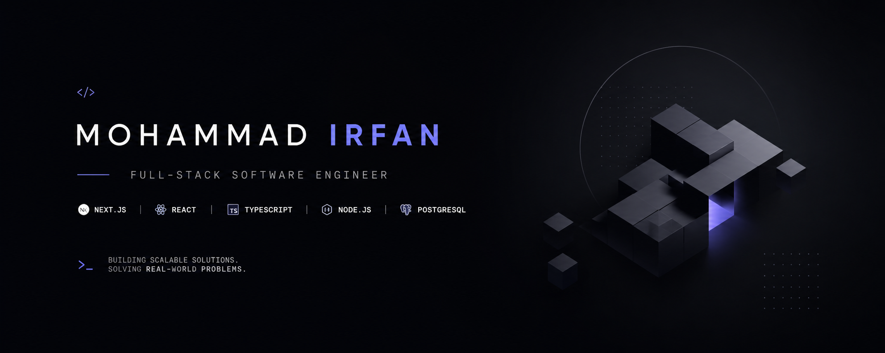

<!-- 
  PREMIUM GITHUB PROFILE README
  Designed for Mohammad Irfan (Full-Stack Developer)
  Aesthetic style: Vercel / Linear / Stripe (Minimal, Modern, Dark-Mode first)
-->

<!-- BANNER -->

  

<!-- HEADER WITH ANIMATED TYPING SVG -->

  <h1>Mohammad Irfan</h1>
  

    
  

  
📍 Dhaka, Bangladesh &nbsp;|&nbsp; 📞 +8801400748802

  
  

    
    
    
    <!-- PORTFOLIO PLACEHOLDER: Replace 'https://your-portfolio.dev' with your actual website URL -->
    
  

---

### ⚡ About Me

I am a Full-Stack Developer with hands-on experience building scalable, production-ready web applications, backend systems, healthcare software, and enterprise ERP systems. I specialize in designing robust architectures featuring authentication, role-based access control (RBAC), secure REST APIs, and third-party integrations. Proficient in PostgreSQL, MongoDB, and Prisma, I focus on writing clean, maintainable code and continuously refining my software engineering skills.

---

### 🚀 Currently Working On & Activities

* 🏥 **Healthcare Software & ERPs:** Designing and building full-stack healthcare platforms and enterprise resource planning systems to streamline workflow efficiencies.
* 🤖 **AI Agents & Google SDK:** Developing autonomous AI agents and integrating intelligent workflows using the Google SDK.
* 🛠️ **VM Hosting & Service Management:** Deploying and managing production applications on Virtual Machines (VM) using Git workflows, **NSSM**, and **Servy**.
* 🎓 **Community Leadership:** Serving as the **Acting President & Web Instructor** for the SMUCT Software Community, mentoring peers in modern web technologies.

---

### 🛠️ Tech Stack & Skills

  <b>Languages & Frontend:</b> 
  

  <b>Backend & Databases:</b> 
  

  <b>Cloud, DevOps & Tools:</b> 
  

---

### 🏆 Featured Projects

A selection of applications built with high standards of UI refinement and code quality.

<table width="100%">
  <tr>
    <!-- Project 1 -->
    <td width="50%" valign="top">
      <h4>🏆 SMUCT CSE Fest 2026 Website</h4>
      
<b>Full-Stack Event Management Platform</b>

      
Built and deployed an event platform with RBAC for admins and participants. Managed database integrations, auth, and storage services. Configured production hosting on university VM, including application deployment and environment setup.

      

        <code>Next.js</code> &bull; <code>Supabase</code> &bull; <code>Vercel</code> &bull; <code>VM Deployment</code> &bull; <code>NSSM</code> &bull; <code>Servy</code>
      

      

        <a href="https://github.com/mohammadirfan90/cse-fest-3" target="_blank">💻 Repository</a> &nbsp;&bull;&nbsp; 
        <a href="https://csefest.smuct.ac.bd" target="_blank">🌐 Live Demo</a>
      

    </td>
    <!-- Project 2 -->
    <td width="50%" valign="top">
      <h4>💬 DevConnect</h4>
      
<b>Real-Time Messaging Web App</b>

      
A real-time developer communication hub supporting secure direct messaging and channels. Implements AES encryption for message payloads. Built with Next.js, MongoDB, and Socket.IO for low-latency delivery.

      

        <code>Next.js</code> &bull; <code>MongoDB</code> &bull; <code>Socket.IO</code> &bull; <code>AES Encryption</code> &bull; <code>TailwindCSS</code>
      

      

        <a href="https://github.com/mohammadirfan90/devconnect-live-chat" target="_blank">💻 Repository</a> &nbsp;&bull;&nbsp; 
        <a href="https://devconnect-live-chat.vercel.app/" target="_blank">🌐 Live Demo</a>
      

    </td>
  </tr>
</table>

---

### 📊 GitHub Analytics

<table width="100%">
  <tr>
    <td width="50%" align="center" valign="middle">
      
    </td>
    <td width="50%" align="center" valign="middle">
      
    </td>
  </tr>
</table>

  

 

<!-- ANIMATED CONTRIBUTIONS SNAKE GAME -->

  <b>👾 Contribution Snake Game</b>  
  

---

  
Designed with minimal elegance • Created by Mohammad Irfan

